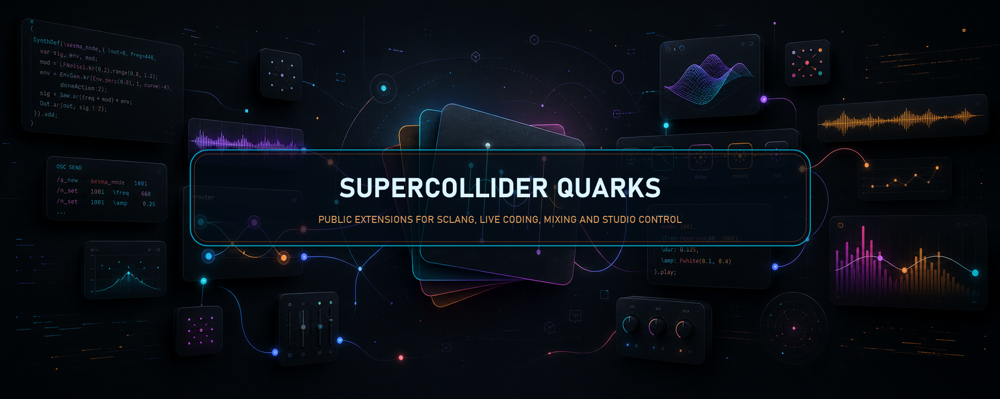

# DJTransitions



[](https://github.com/ramonsesma/DJTransitions/releases)
[](https://github.com/ramonsesma/DJTransitions/actions/workflows/validate.yml)
[](https://github.com/ramonsesma/DJTransitions/blob/main/LICENSE)
[](https://github.com/ramonsesma/DJTransitions/releases/tag/0.1.0)

A SuperCollider quark with five DJ transition recipes — bass swap, full
crossfade, filter sweep, doublestop, and scribble. Each automates two
channel-strip `Synth` instances over a window via per-frame `.set` calls
on a Routine.

## Classes

| Class | Style |
|---|---|
| `DJTransitionBassSwap` | A's `\lo` falls / B's `\lo` rises; both decks at full level. |
| `DJTransitionFullCrossfade` | Equal-power √ level crossfade. |
| `DJTransitionFilterSweep` | A LPF closes 18 kHz → 400 Hz; B opens with the opposite log sweep. |
| `DJTransitionDoublestop` | Hold both decks near full, hand off A in the last 15 %. |
| `DJTransitionScribble` | Quick alternating chops, density rising as B wins. |
| `DJTransitions` | Facade — `.play(:style, deckA, deckB, durationSec)`. |
| `DJTransition` | Abstract base — subclass and override `*curve(t)` for new recipes. |

## Contract

Each transition expects two `Synth` instances with channel-strip controls.
The bundled subclasses speak the Studio Sesma DJ engine vocabulary:

| Control | Default range |
|---|---|
| `\level` | 0..1 |
| `\lo` `\mid` `\hi` | 0..1 (3-band EQ) |
| `\cutoff` | Hz |
| `\filterType` | 0 = off, 1 = LPF, 2 = HPF |

Subclass and override `*curve` if your strip uses different names.

## Quick start

```supercollider
~deckA = Synth(\webDjDeckStereo, [\bufnum, bufA, \level, 1]);
~deckB = Synth(\webDjDeckStereo, [\bufnum, bufB, \level, 0]);

~routine = DJTransitions.play(\bassSwap, ~deckA, ~deckB, 4);
// ... or bail early:
~routine.stop;

// No server needed — render the automation curve to an array:
DJTransitions.renderFrames(\filterSweep, 4, 30);
```

## Install

```supercollider
Quarks.install("https://github.com/ramonsesma/DJTransitions");
```

## Test

Run from the repository root:

```powershell
& 'C:\Program Files\SuperCollider-3.14.1\sclang.exe' -D -r -s --include-path 'Classes' --include-path 'tests' 'tests\RunDJTransitions.scd'
```

Or inside sclang after loading the Quark classes:

```supercollider
TestDJTransitions.run;
```

`renderFrames` powers most of the tests — no scsynth needed to verify
the curves.

## Notes

The five styles are the same recipes the Studio Sesma DJ planner uses
internally; this quark exposes them as reusable building blocks for any
SC-based DJ rig or live-coding session.

License: MIT.

